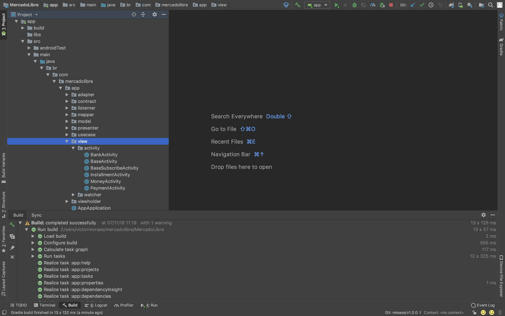
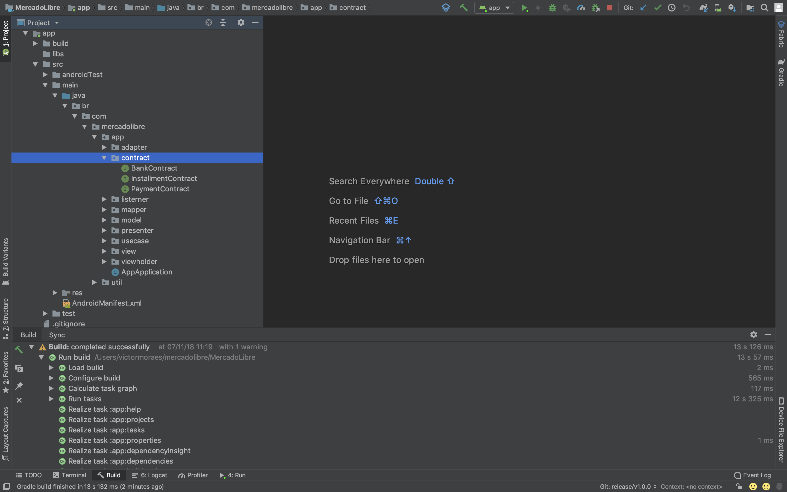
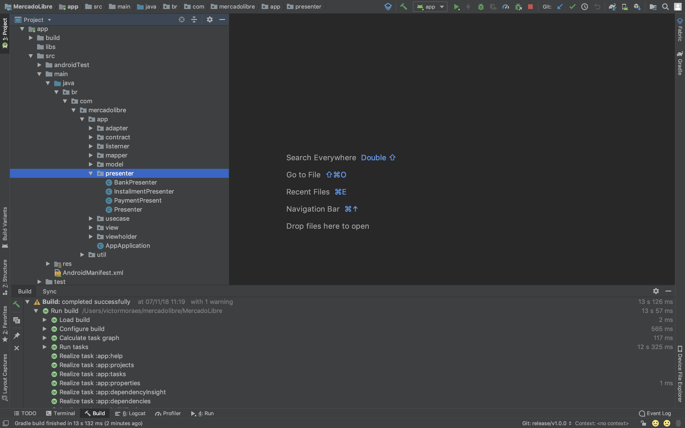
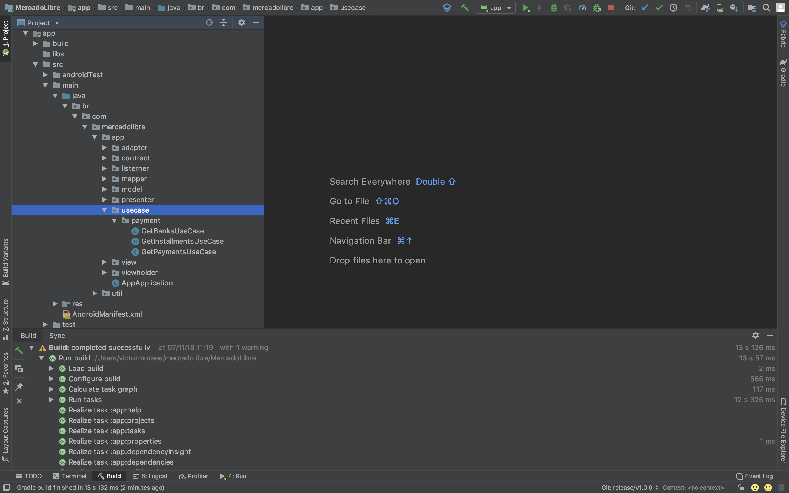
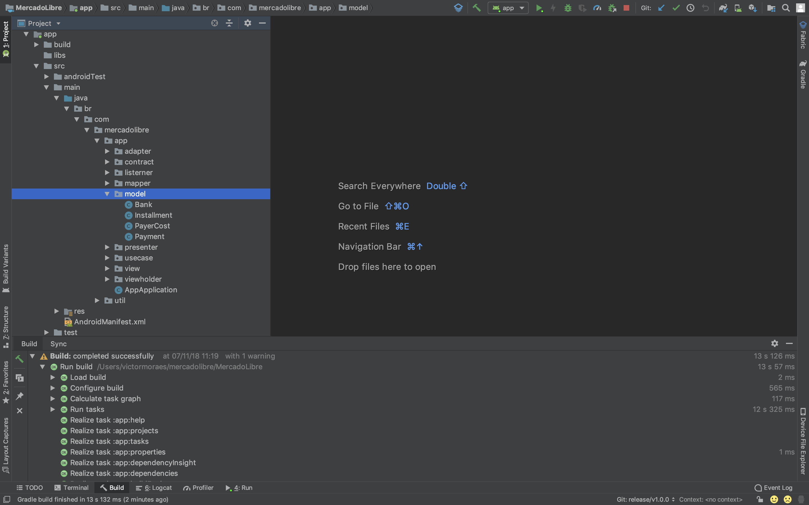
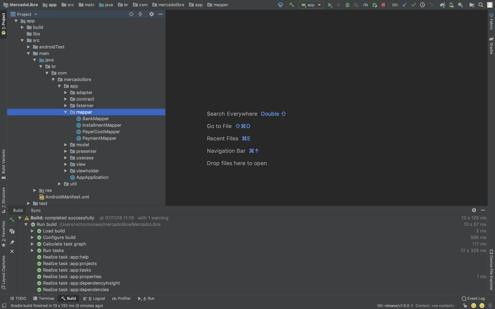
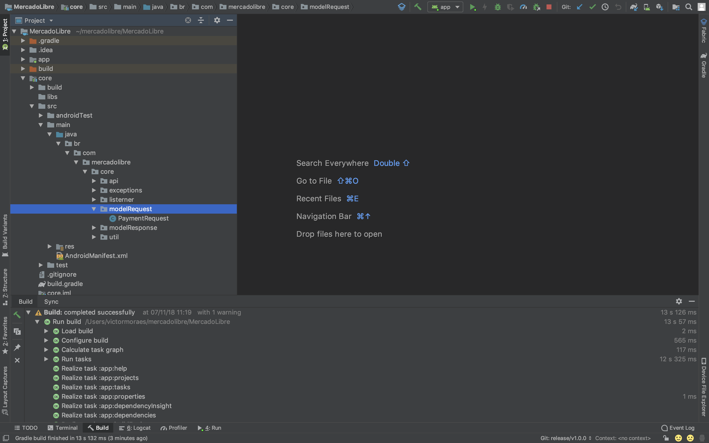
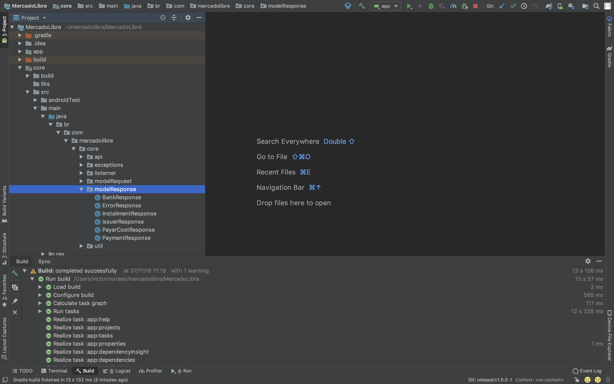
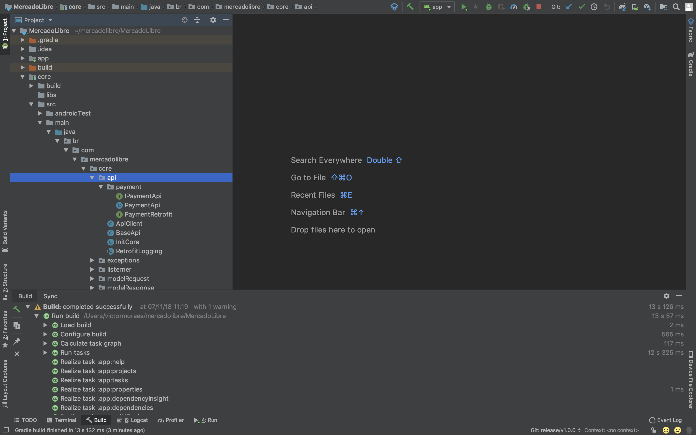

Um diferencial foi a padronização do Adapter para as listas e ViewHolder, onde todas as listas que precisam ser criadas seguem um mesmo contrato, tornando mais pratico o desenvolvimento.

Também foi pensando a falta de memória ou quando uma atividade precisa ser encerrada pelo sistema operacional Android, portando irão ver a presença de "InstanceState" e "onSaveInstanceState" no qual internamente o Android Annotations salvas os objetos no Bundle da Activity, e o recupera quando volta para atividade, economizando portando requisições desnecessárias ou perdas de dados quando por exemplo o usuário atende um telefonema e volta para o aplicativo.

O foco dessa POC foi focado em arquitetura MVP.

-----Frameworks-----

- Android Annotations
- Retrofit
- Gson
- EventBus
- Picasso

# Entendendo o Projeto

Esse projeto utiliza o conceito MVP (Model View Presenter) com **UseCases**, ou seja, temos a camada da **View** que se comunica com o **Presenter** no qual se comunica com os **UseCases** e os mesmo se comunicam com os Serviços(**core**).

**APP**

* Tela - **View** responsável por mostrar informações ao usuário, como **Activity, Fragment, Dialog e etc**. 

* Contract - **Interface** responsável por garantir o **contrato entre o Presenter e a View**.

* Presenter - responsável por fazer a comunicação entre a **View** e os **UseCase**, **(NO PRESENTER NÃO VAI REGRA DE NEGÓCIO, POIS SE NÃO O USECASE FICA SEM EMPREGO)**

* UseCase - responsável por fazer a comunicação entre **Presenter** e o Serviço(**core**), sendo aqui onde fica as regras de negócios e conversão dos objetos entre **App e Core** utilizando os **Mapper**, **(NADA DE FAZER CONVERSÃO FORA DOS MAPPERS, POIS ELES PRECISAM DESSE EMPREGO)**

* Model - responsável por representar os dados de um Objeto para as **View**

* Mapper - responsável por converter o **ModelResponse do Core** em **Model do App**

**CORE**

* ModelRequest - Model que representa o conjunto de dados para uma requisição

* ModelResponse - Model que representa a resposta de uma requisição

* API - Classe que controla as chamadas 

